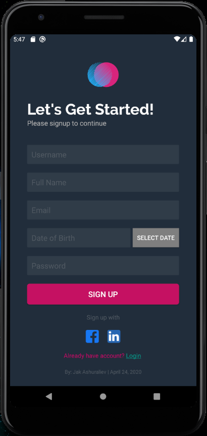
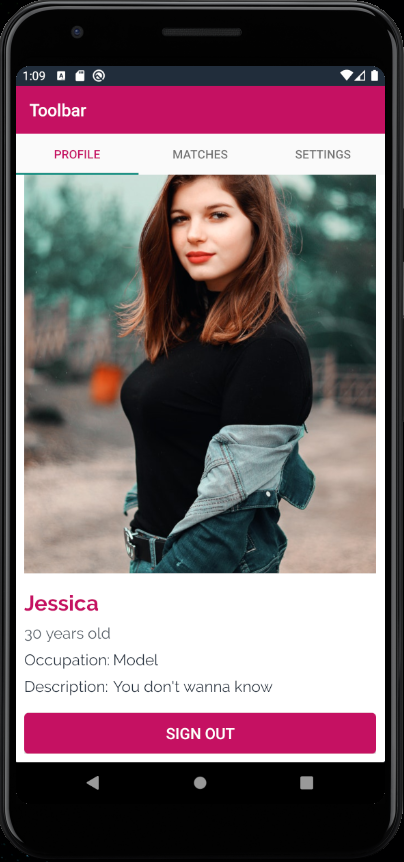
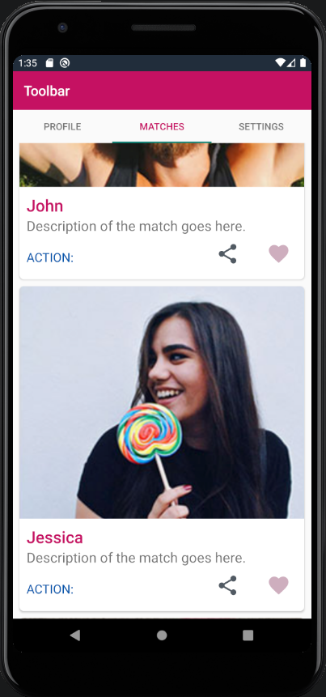

# Android App Development
This class covers core concepts of mobile application development with a focus on the Android platform. Students will learn key skills used by professional Android mobile developers, and will design, develop and publish a fully-functional mobile application they can reference for job applications or future projects. 

## App Screenshots

## Class Topics

#### Each week students will have assigned reading, tutorials or video lectures, as well as online lectures and exercises covering the following topics:

* Intro to Android
* Android activities & UI elements
* Android Layout
* Dependency management
* Android testing & debugging
* Menus & navigation 
* Complex UI with fragments
* Asynchronous tasks, services & notifications
* Data storage & content providers
* Graphics & animation
* Application deployment
* Using Continuous Integration with Android
